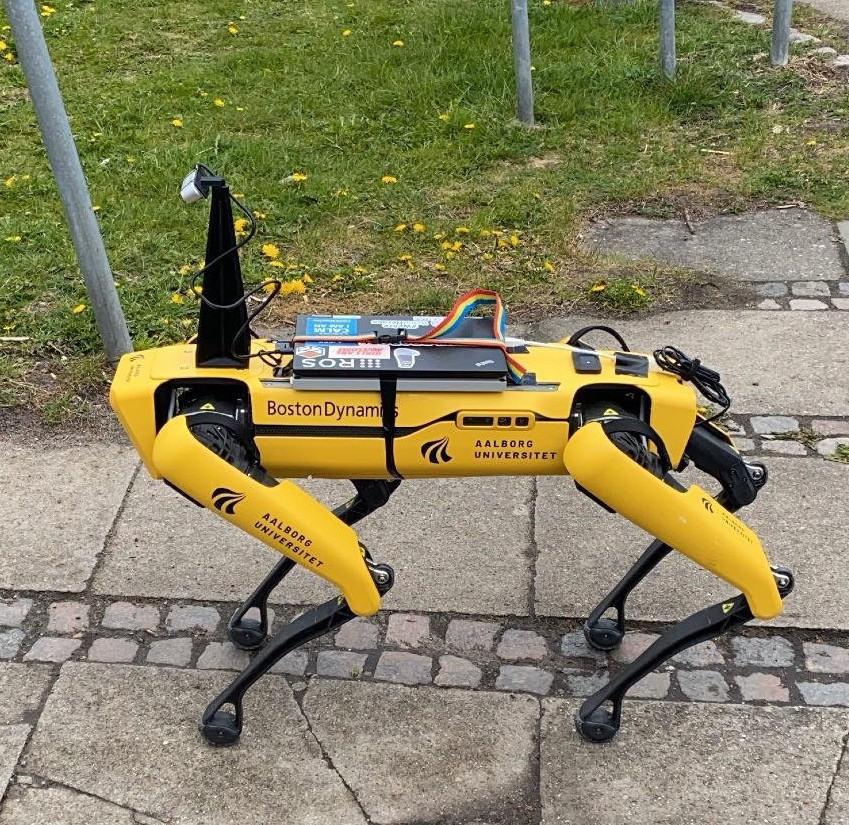
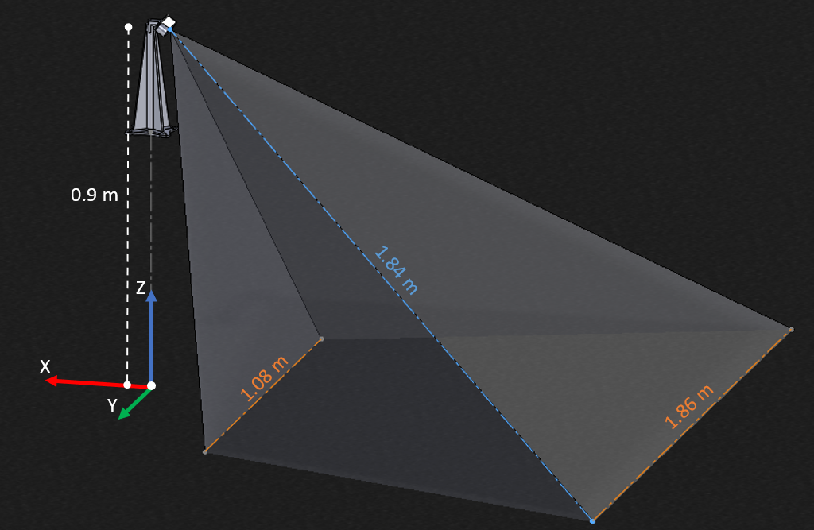
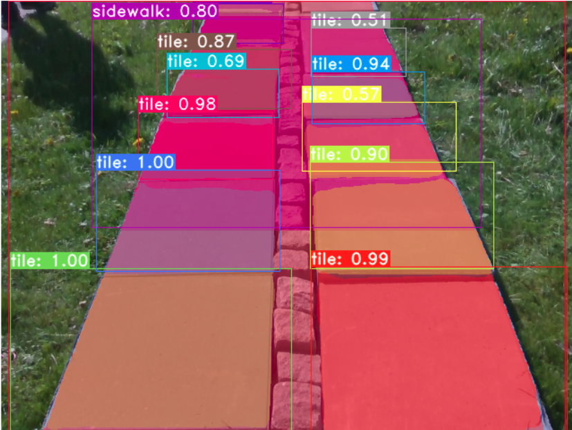
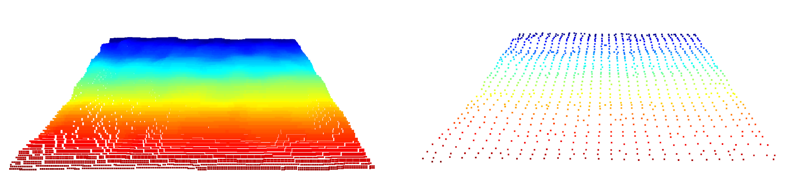
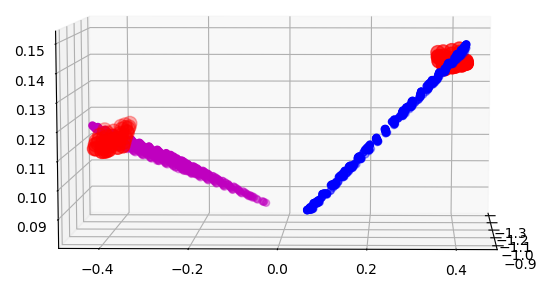
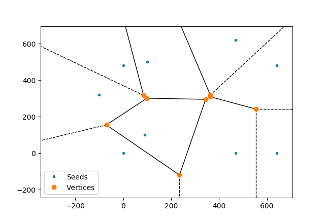
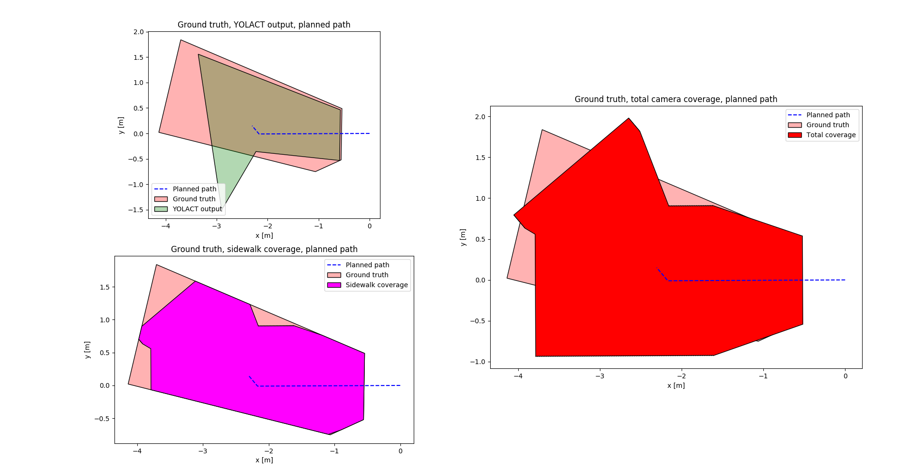

# Autonomous Sidewalk Inspection
This repository is the software part, of the 6th semester project, for the Baschelor in Robotics at Aalborg University.
The project is titled Autonomous Sidewalk Inspection.
The software plans a path for a Boston Dynamics Spot robot, in order to follow a sidewalk, while an Intel Realsense D435 stereo camera captures RGB-D data in order to search for both sidewalk depressions and tile displacements.

Here you can find a [video](https://www.youtube.com/watch?v=yxd9BVQ70Hs) of the system in action.

## System
The system consists of a Boston Dynamics Spot robot, with an Intel stereo camera attached in a fixture placed atop the robot.

The fixture is designed with the camera's field of view, the height of the robot, and the typical width of a sidewalk in mind. Keeping the sensor closer to the ground would provide less noise in the captured depth data, but would also provide less coverage of the sidewalk.

An onboard computer uses camera data for segmentation and object recognition in the images, and uses the data to scan for defects as well as for path planning.

## Segmentation
The system performs segmentation using the convolutional neural network [YOLACT](https://github.com/dbolya/yolact), a CNN made for real-time instance segmentation. This gives the system the ability to identify individual tiles in the sidewalk, as well as areas of cobblestone. 

## Defect detection
In order for the system to tile displacements a plane was fit to each tile and their slopes compared. 
To find depressions in the sidewalk, a plane was fit to the whole sidewalk. Since depressions occur mainly at tiles, the cobblestone sections were used as a reference height for the sidewalk. Large deviations in the average height of a cross-section of the sidewalk was interpreted as a depression in the sidewalk.

## Path planning
Path planning used visual information by identifying the corner pixels in the RGB image and acquired the corresponding world coordinates from the world depth image. Then, the path was planned by computing a Voronoi-diagram for the corner coordinates in the xy-plane. 

The resulting graph was searched with an A*-algorithm, to find shortest path across the sidewalk. This generates a path through the perceived center of the sidewalk, maximizing the coverage of the camera for scanning.

